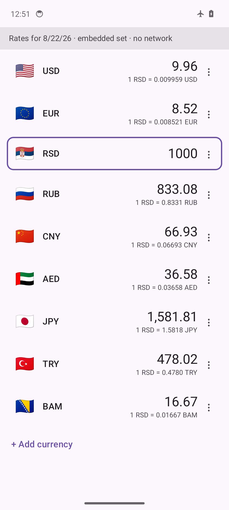
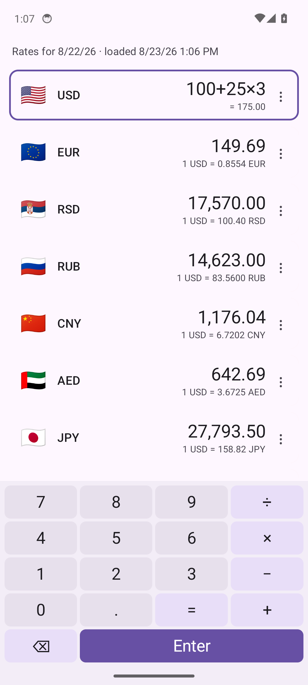
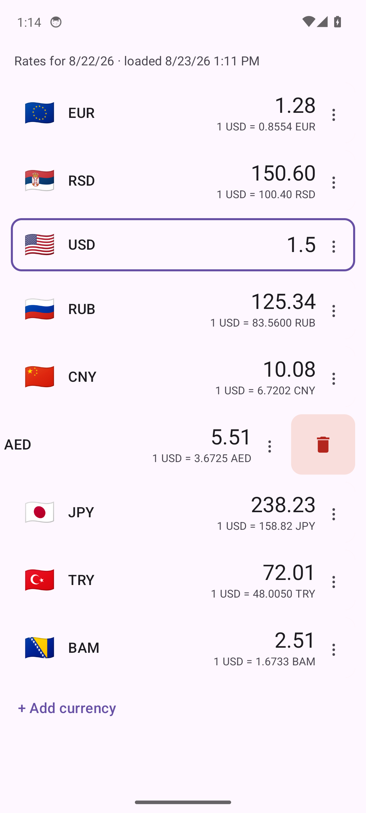
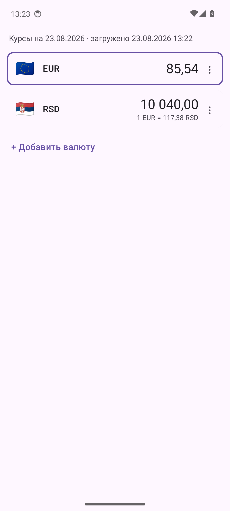

# Курсы валют

Конвертер валют для Android, который работает без сети и умеет считать. Касание любой строки делает её валюту основной: вводится сумма — остальные строки пересчитываются на каждом нажатии. Курсы берутся из бесплатных публичных источников: своего сервера, учётной записи и аналитики у приложения нет.

[English version](README.md)

| Список курсов | Калькулятор | Удаление свайпом | Русский интерфейс |
|---|---|---|---|
|  |  |  |  |

## Возможности

- **Мгновенный запуск.** Список строится из сохранённого (или встроенного) набора курсов до обращения к сети; свежие курсы подгружаются в фоне.
- **Ввод в любой строке.** Касание делает валюту строки основной. Прежнее число остаётся видимым и заменяется первой набранной цифрой.
- **Клавиатура-калькулятор.** У приложения своя панель со знаками `+ − × ÷` и `=`. Выражение вида `100+25×3` считается с обычным приоритетом действий, остальные строки следуют за текущим значением. Точка и запятая равнозначны.
- **Свой список.** Добавляются любые из примерно 165 валют плюс золото (XAU), серебро (XAG) и биткоин (BTC); поиск по коду и названию. Порядок меняется удержанием ручки и перетаскиванием, удаление — свайпом влево и касанием корзины. Состав, порядок, основная валюта и сумма сохраняются между запусками.
- **Честная свежесть.** В заголовке видны дата набора у источника и момент загрузки, а также пометки «нет сети», «не удалось обновить» и «курсы могли устареть».
- **Работа без сети.** Без подключения приложение показывает последний сохранённый набор и продолжает считать. Встроенный стартовый набор делает полезным даже первый запуск.
- **Источник на каждую валюту.** Каждая валюта привязана к обслуживающему её источнику; свайп строки вправо обновляет именно его.
- **Русский и английский** по языку устройства; числа и даты — в формате языка.

## Курсы и источники данных

Все курсы — ежедневные справочные. Ключ API не требуется; наружу уходят только запросы курсов.

| Источник | Для чего | Лицензия и условия |
|---|---|---|
| [Frankfurter](https://frankfurter.dev) (`api.frankfurter.dev`) | Фиатные валюты, золото (XAU), серебро (XAG) | Сервис под лицензией MIT, использование свободное; сами справочные курсы — от центральных банков |
| [currency-api](https://github.com/fawazahmed0/exchange-api) (`latest.currency-api.pages.dev`, запасной адрес jsDelivr) | Биткоин (BTC) | CC0 1.0 |

Курсы справочные и не равны цене обмена в конкретном пункте. Приложение не даёт финансовых советов — не стоит опираться только на него при сделке.

## Установка

Скачать APK из [последнего выпуска](https://github.com/dzhokhov/currency-rates-android/releases/latest) и открыть файл на устройстве либо установить через ADB:

```bash
adb install -r currency-rates-<версия>.apk
```

- Android 8.0 (API 26) и новее.
- Единственное системное разрешение — доступ в сеть.
- Выпуски подписаны одним ключом, поэтому новая версия ставится поверх старой с сохранением списка. Сборка из исходников с другим ключом поверх выпуска не встанет — сначала удалить приложение.
- Проверка загруженного файла по контрольной сумме, опубликованной рядом с APK:

```bash
shasum -a 256 -c currency-rates-<версия>.apk.sha256
```

## Сборка из исходников

Нужны JDK 17 и Android SDK с платформой 35 и build-tools 35.0.1; версия Gradle (8.9) закреплена обёрткой.

```bash
git clone https://github.com/dzhokhov/currency-rates-android.git
cd currency-rates-android
./gradlew test lint assembleDebug
```

Отладочный APK появится в `app/build/outputs/apk/debug/`. Для `assembleRelease` нужен ключ подписи: файл `keystore.properties` в корне проекта с полями `storeFile`, `storePassword`, `keyAlias`, `keyPassword`; сам ключ и этот файл в систему контроля версий не попадают.

## Как устроено

Один модуль Gradle, Kotlin и Jetpack Compose, без библиотек внедрения зависимостей, сетевых клиентов и сериализации:

- `core` — реестр валют, пересчёт через внутреннюю базу USD на `BigDecimal`, правила показа чисел, разбор и вычисление выражений, правила свежести, минимальный разборщик JSON, сохраняющий точность числовых литералов.
- `sources` — клиент на `HttpURLConnection`, по адаптеру на источник и репозиторий, решающий, что и когда обновлять.
- `storage` — атомарные файлы JSON в личном каталоге приложения: состояние пользователя, состояние обновления, по одному сырому ответу на источник.
- `ui` — один экран с явным вентилем режимов (покой, ввод, сдвинутая карточка, перетаскивание), панель-калькулятор и экран выбора валюты.

Подробнее: [docs/architecture.md](docs/architecture.md), [docs/data-sources.md](docs/data-sources.md).

## Приватность

Ни учётных записей, ни телеметрии, ни рекламы, ни сторонних библиотек аналитики. Приложение обращается только к двум перечисленным адресам курсов; всё, что оно помнит, лежит в его личном хранилище на устройстве.

## Планы

- Курсы «в моменте» вторым слоем поверх ежедневного набора.
- Лист «О курсах»: источник, слой и время по каждой валюте.
- Переключатель языка внутри приложения, независимый от языка устройства.

## Участие в разработке

Задачи и запросы на слияние приветствуются — [CONTRIBUTING.md](CONTRIBUTING.md) и [Кодекс поведения](CODE_OF_CONDUCT.md). Сообщения об уязвимостях — [SECURITY.md](SECURITY.md).

## Лицензия

[Apache License 2.0](LICENSE) © 2026 Dmitry Zhokhov
